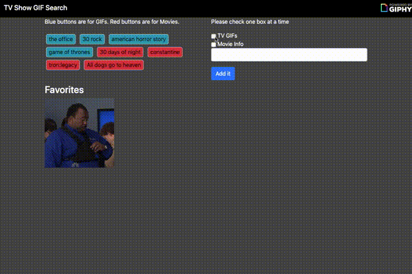
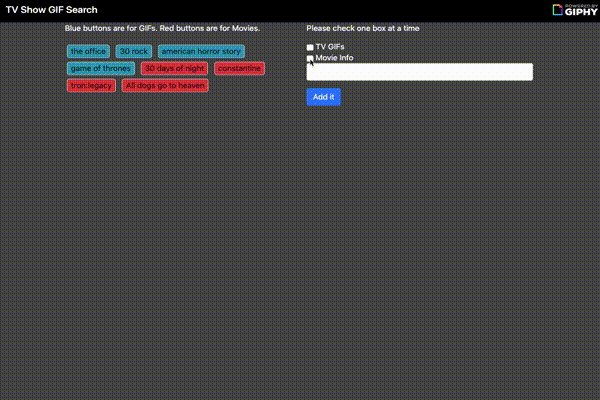
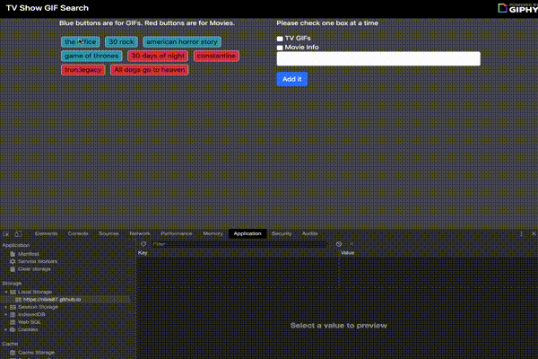

# TV-gifs

#### Adding Gifs

#### Adding Movies

#### Add Gif to Favorites

## Overview

A user inputs a tv show to add new buttons to the page. To add gifs to page the user then has to click one of the prestored or created buttons. Using the giphy API the data-name of the button pressed sends a query url to append 10 random gifs from the query onto the page. If the user likes a gif they can add it to their favorites by right clicking.

Upon returning to the site they're favorites will be stored and returned to the page.

The user also has an option the add movie info to the page by selecting to make movie buttons before the input text section. It acts the same as the tv gifs except the user cannot store the movies in the favorites section, they have to search for the movies new each time they visit the site.

The app also responds to whether or not the user has their computer set on light mode or not.
